# System Specification: Edge City Real Estate Finder

> [!NOTE]
> This system identifies "Minimum Viable Towns"—distressed but functional assets (colleges, camps, resorts) suitable for rapid activation by a community of 200+ builders.

## 1. System Architecture: Three-Stage Funnel

```mermaid
graph TD
    subgraph "🔝 TOP: Discovery"
        P[Platforms: LoopNet, Crexi, Auction.com]
        N[Local News: closures, bankruptcies]
        P --> Scout[Scout Agent]
        N --> Scout
    end
    
    Scout --> |Raw Candidates| DB[(Database)]
    DB --> Analyst
    
    subgraph "🔄 MIDDLE: Verification"
        Analyst[Analyst Agent - Gemini]
    end
    
    Analyst --> |Classified| DB
    DB --> Portal
    
    subgraph "🎯 BOTTOM: Manual Review"
        Portal[Manager Portal]
    end
```



### Funnel Stages
| Stage | Status | Description |
|-------|--------|-------------|
| **Discovered** | Raw | Found by Scout, awaiting verification |
| **Qualified** | Lead | Verified as real, available listing |
| **Interesting** | Watch | News article or not-yet-available |
| **Contacted** | Active | Team has reached out |
| **Dismissed** | Archived | Not relevant (pattern captured) |

---

## 2. The Agentic Workflow

### Step 1: The Scout (Discovery)
**Goal**: Find potential properties from multiple sources.
*   **Frequency**: Weekly (automated via Railway cron).
*   **Data Sources**:
    - Listing platforms (LoopNet, Crexi, Auction.com, Ten-X) via Exa/Tavily
    - Local news for "college closing," "resort bankruptcy," "foreclosure"
    - WARN notices, legal filings
*   **Output**: Raw candidates with source tracking and discovery reason.

### Step 2: The Analyst (Verification)
**Goal**: Verify each discovery is real and classify appropriately.
*   **Engine**: Gemini Flash
*   **Checks**:
    - **Link Verification**: URL loads with relevant content
    - **Listing vs Article**: Is this purchasable or just news?
    - **Availability**: Not already sold/acquired
    - **Criteria Match**: Beds, acreage, price range
*   **Output**: `qualified` or `interesting` + verification reason

### Step 3: Manual Review (Your Team)
**Goal**: Human review of qualified leads.
*   **Actions**:
    - ⭐ Star → Hot lead
    - 📋 Contact → Mark as "Reached Out"
    - ❌ Dismiss → Hide + capture pattern
*   **Feedback Loop**: Dismissed patterns inform future Scout queries

---

## 3. The Data Structure

```sql
-- Core Fields
id, title, url, price, location, description, score
status: New / Starred / Reviewed / Contacted / Passed / Archived

-- Funnel Tracking
funnel_stage: discovered / qualified / interesting / contacted / dismissed
verification_result, verification_reason
source_type: listing / news / auction
discovered_via: query that found this

-- Feedback
dismissed_reason, dismissed_pattern

-- Stats
acreage, bed_count, year_built
nearest_airport, drive_time_minutes
ai_summary, image_url
```

---

## 4. The Interface

Two-tab layout:
1. **Qualified Leads** - Verified, available properties
2. **Interesting Finds** - News, articles, watching items

Features:
- "New" badge for recent discoveries
- Manual search controls (run custom queries)
- Dismiss with reason dropdown
- Filter by funnel stage

---

## 5. Technology Stack
*   **Backend**: Python (FastAPI)
*   **Discovery**: Exa.ai + Tavily
*   **Verification**: Gemini Flash
*   **Database**: Supabase
*   **Frontend**: Next.js
*   **Hosting**: Railway (with cron for weekly runs)

---

## 6. Deployment
*   **Backend**: Railway (FastAPI container)
*   **Frontend**: Vercel or Railway
*   **Database**: Supabase (cloud)
*   **Scheduling**: Railway cron (weekly)
